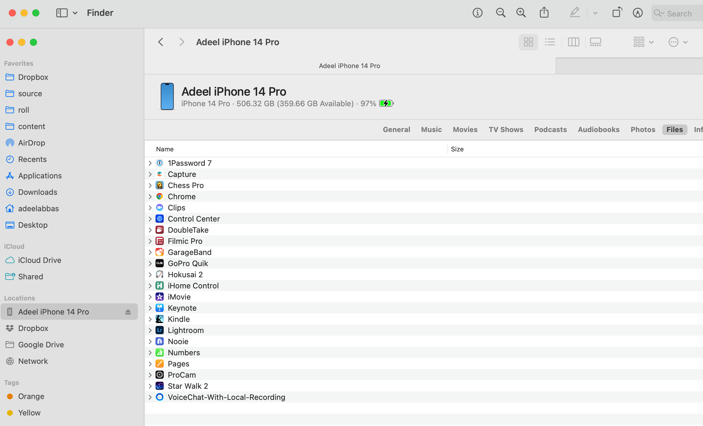
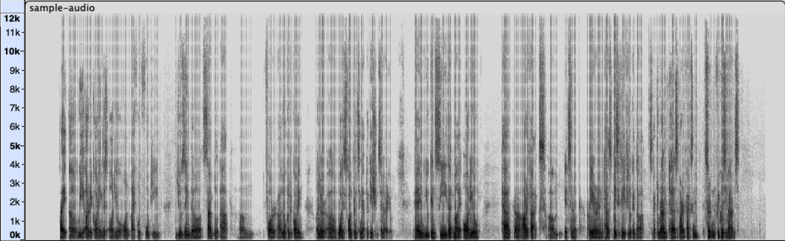

## Local audio recording bug on iPhone 14 for voice-conferencing applications

### Overview
We are experiencing a local audio recording issue on iPhone 14 for a voice conferencing application. There is no problem on iPhone 13 and older devices. Also interesting to note is that when an iPhone 14 device is the only device in the call, the problem does not happen. We think the problem might be related to hardware echo cancellation on the iPhone 14 - when it's speaker is open, the audio captured by device has audible artifacts.

### How to Reproduce Problem

- Run the following command to clone source code:
```bash
git clone git@github.com:adeelabbas/VoiceChat-With-Local-Recording.git
```
- Run following command to install pods:
```bash
cd VoiceChat-With-Local-Recording
pod install
```
- Please email [me](adeel@roll.ai) for `AppId` and `Certificate` - enter them in [Source/Common/KeyCenter.swift](https://github.com/adeelabbas/VoiceChat-With-Local-Recording/blob/main/Source/Common/KeyCenter.swift).
- Run app on two devices - one on iPhone-14 and the other on iPhone-13 (or older).
- Tap `Join` on iPhone-13 (a default channel is automatically filled up in the text box). Then tap `start recording`.
- Take iPhone-14 to another room - to minimize echo since both devices will be in the same call - tap `Join`, then `start recording`.
- Speak some words in the iPhone-14 - record for 30 seconds. Then, tap `stop recording` on both devices.
- Connect iPhone 14 to Mac computer and open Finder app. Click on the icon showing iPhone-14 name on left panel and navigate to `Files` tab. Then click on `>` symbol next to  `VoiceChat-With-Local-Recording`.



- There will be an audio file with `m4a` extension - drag and drop it to your local directory and play. Audio will have artifacts. [Here](https://www.dropbox.com/s/lpxw2fh0o7ojq60/Sample-audio.m4a?dl=0) is a sample audio with the artifacts (this file is also available in this repo at [Media/Sample-audio.m4a](https://github.com/adeelabbas/VoiceChat-With-Local-Recording/blob/main/Media/sample-audio.m4a)).
- If we download similar file on the iPhone-13, the audio file does not have any artifacts.


### Technical Details
- In order to implement voice conferencing, we are using Agora Voice SDK. Detailed info about Agora API is available [here](https://api-ref.agora.io/en/voice-sdk/ios/4.x/API/rtc_api_overview_ng.html).
- On joining a call, we are calling [setAudioSessionOperationRestriction](https://github.com/adeelabbas/VoiceChat-With-Local-Recording/blob/88e4bd222ed2baeb9d5441819ef850de36c6c64e/Source/JoinChannelAudio.swift#L218) on Agora SDK. This tells Agora SDK to not configure audio session, or change it's category.
- Local audio session is setup by calling [AudioDevice.setupAudioSession](https://github.com/adeelabbas/VoiceChat-With-Local-Recording/blob/88e4bd222ed2baeb9d5441819ef850de36c6c64e/Source/JoinChannelAudio.swift#L189) which internally calls methods of `AVAudioSession` for instance [AVAudioSession.setCategory](https://developer.apple.com/documentation/avfaudio/avaudiosession/1771734-setcategory).
- Local audio is recorded using `captureOutput` method that is implemented for `JoinChannelAudioMain` class, and `AudioFileRecorder` class which is a wrapper for `AVAssetWriter` class.

When we observe Spectrogram of audio that is recorded from iPhone-14 (shown below), there seem to be gaps at certain frequency bands in audio file, probably due to aggresive audio signal processing. We think the cause of these might be echo cancellation algorithm on the iPhone-14.



